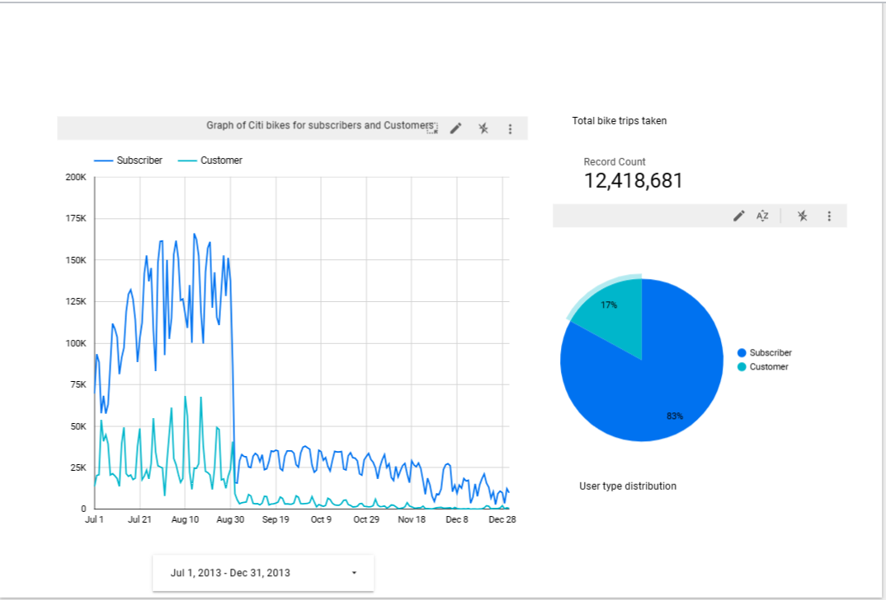

Data Engineering Project:
This is an end to end data pipeline that shows how data is extracted from a source using python and prefect as our
workflow orchestration tool. 
The data is fetched, cleaned to remove Null values and change dtype for starttime and endtime which is eventually sent to google cloud storage which is our datalake.
We create another python script with prefect orchestration to create a dataset in our bigquery which is our datawarehouse.
This ends the ELT flow.

To move to ETL, we use dbt to extract the datasets from bigquery and perform data transformations and eventually create a view for our dataset.

Finally we use looker to analysis the data 

.png)

